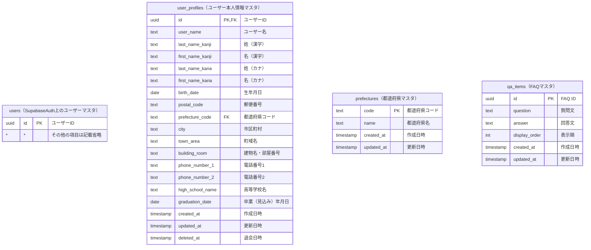
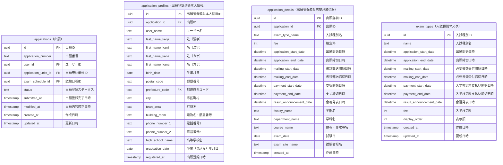
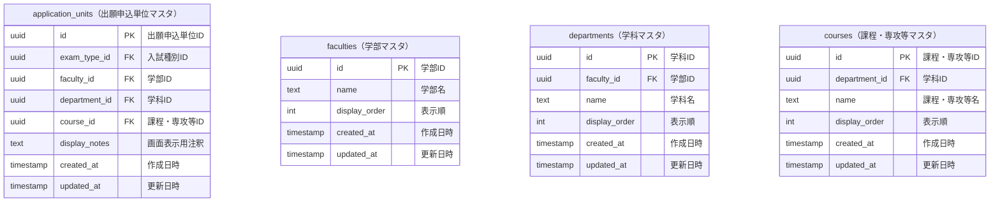
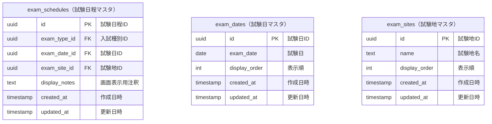
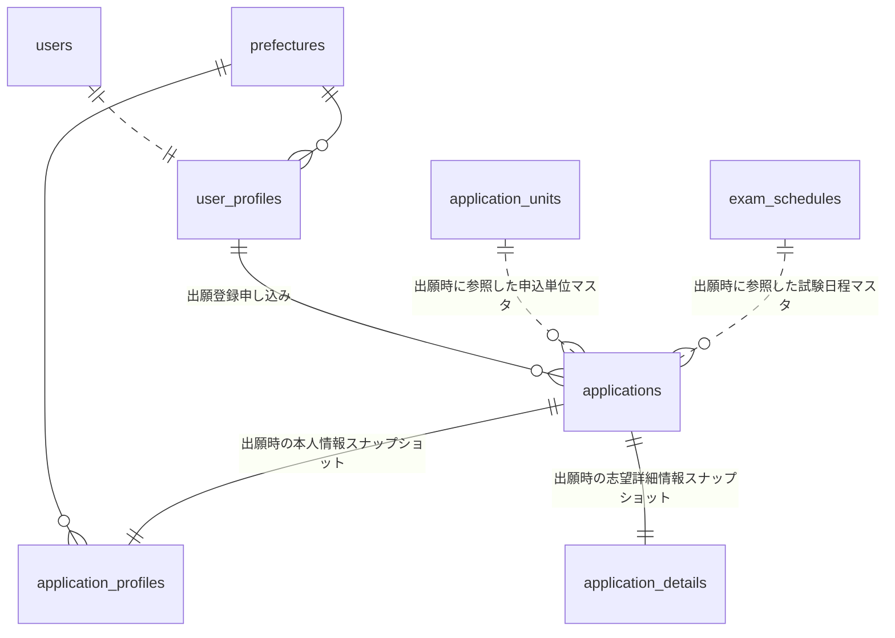
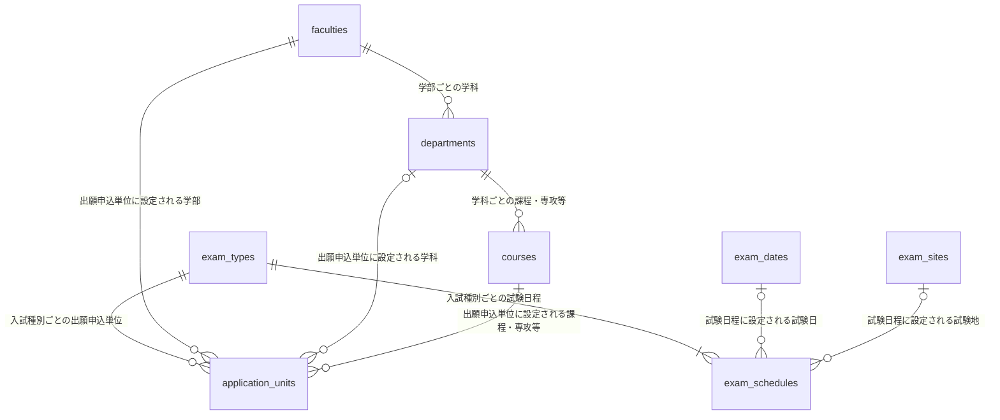

# UnivApplicationSubmissionApp

## プロジェクト概要

一般的な大学入試を想定した出願申し込みWebアプリケーションのモックアップです。  
エンドユーザーである受験生が、出願申し込み、並びに、受験に係る諸々の手続きや確認操作を
快適に行うことができるアプリケーション（Web出願サイト）を目指します。  

## 使用技術

- **Frontend Framework**: Next.js 15.1.6 (App Router)
- **Language**: TypeScript 5
- **UI/Styling**: Tailwind CSS 4, Radix UI, Lucide React
- **Animations**: Framer Motion
- **Form Handling**: React Hook Form, Zod
- **Backend/Database**: Supabase
- **Package Manager**: npm (Node.js v22 recommended)

## 機能一覧

### 既に実装済みの機能

- 受験生ユーザーのアカウント作成（メール認証・本登録フロー対応）
- 受験生本人の属性情報（プロフィール）の登録・修正機能
- 出願可能な入試種別と各日程情報の一覧確認（TOP画面）
- 出願申し込み（入試種別、学部、試験日などの志望情報と受験生本人情報の登録：確認ステップ付き）
- マイページ（アカウント情報、本人情報、出願状況の確認）
- 出願取消機能（モダンな確認ダイアログとトースト通知UI）
- FAQ（Q&A）ページの実装
- 外部サイト（大学公式サイト等）へのナビゲーションリンク

### 今後実装したい機能

- 入学検定料の決済～入金状態のステータス管理
- 出願写真や必要書類等のファイルアップロード
- 受験票のダウンロード
- サイト内キーワード検索（ヘッダー上の検索窓UIのみ実装済み）

## ER図



</br>



</br>



</br>



</br>



</br>



## ディレクトリ構成

```text
.
├── src/
│   ├── app/                # App Router (各ページ、API、Server Actions等)
│   │   ├── (auth)/         # 認証関連（ログイン、コールバック等）
│   │   ├── signup/         # 新規アカウント登録
│   │   ├── application/    # 出願登録（メインフロー）
│   │   ├── mypage/         # マイページ
│   │   └── qa/             # Q&Aページ
│   ├── components/         # Reactコンポーネント
│   │   ├── layout/         # ヘッダー等のページレイアウト用コンポーネント
│   │   ├── mypage/         # マイページ用コンポーネント
│   │   ├── profile/        # 本人情報登録ページ用コンポーネント
│   │   └── ui/             # 汎用UI（Alert, Button, Card等）
│   ├── lib/                # スキーマ定義、共通型、ユーティリティ
│   └── utils/              # Supabaseクライアント等の設定
├── supabase/               # ローカル環境上のSupabaseプロジェクト構築用（DB、メールテンプレート等）
├── public/                 # 静的コンテンツ（画像ファイル、プレーンHTML等）
├── next.config.ts          # Next.jsアプリケーションの動作設定用ファイル
├── tsconfig.json           # TypeScriptのコンパイル設定用ファイル
├── postcss.config.mjs      # PostCSSのCSS変換・加工に関する設定用ファイル
├── eslint.config.mjs       # 静的コード解析ツール（ESLint）の設定用ファイル
├── package.json            # プロジェクトの依存関係やnpmスクリプトの設定用ファイル
├── package-lock.json       # インストール済みパッケージの依存関係やバージョン情報の記録用ファイル
├── .gitignore              # Gitバージョン管理除外対象の設定用ファイル
└── README.md               # 本プロジェクトの取扱説明書（本ドキュメント）
```

## 開発環境構築

### 前提条件

- Node.js v22系以上
- npm

### セットアップ手順

1. 本プロジェクトのリポジトリを各自のローカル環境上にクローンします。
2. 必要な外部ライブラリのパッケージ一式（`/node_modules`）をインストールします。

   ```bash
   npm install
   ```

3. プロジェクトルートのディレクトリ直下に `.env.local` ファイルを作成し、Supabaseへの接続情報を設定します。

   ```text
   NEXT_PUBLIC_SUPABASE_URL=各自のSupabaseプロジェクトURL
   NEXT_PUBLIC_SUPABASE_ANON_KEY=各自のSupabase Anon Key
   ```

4. 開発サーバーを起動します。

   ```bash
   npm run dev
   ```

5. ブラウザで [http://localhost:3000](http://localhost:3000) にアクセスし、アプリケーションが起動していることを確認します。

### トラブルシューティング

- **`Access is denied` エラー (Turbopack)**:
  Windows環境にて `npm run dev` 実行時に権限エラーが発生する場合、`.next` フォルダを削除してから再実行してください。

  ```powershell
  Remove-Item -Recurse -Force .next
  npm run dev
  ```

## 備考

- 本プロジェクトは Vercel へのデプロイを想定しています。
- ローカル環境上のSupabaseに接続（ `npx supabase start` で立ち上げたDockerコンテナを使用）する場合、  
    `/supabase/config.toml` ファイルを編集して認証やメール送信等に関する設定変数を適宜書き換えて使用してください。
